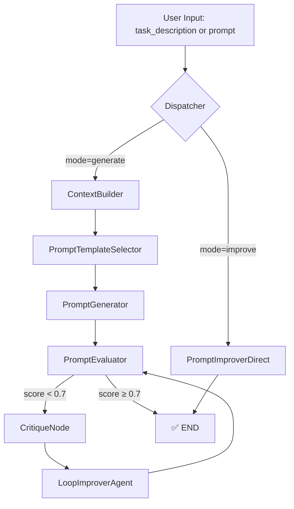

Here's a complete **`README.md`** file for your project — written from the perspective of a **professional content writer** and **Generative AI developer**. It includes:

* Project overview
* Visual architecture
* Features
* Installation & usage instructions
* Example outputs
* Tech stack

---

## 🧠 PromptCraft AI — Intelligent Prompt Generator & Improver

> A multi-node LangGraph-based agent pipeline that **generates, evaluates, critiques**, and **improves LLM prompts** dynamically using Groq's blazing-fast **LLaMA 3.1 8B** model.
> Built for developers, researchers, and prompt engineers who demand **high-quality prompts**.

---

### 📸 Project Architecture



---

## ✨ Features

* 🔁 **Graph-based modular pipeline** using LangGraph
* 🚀 Powered by **Groq's LLaMA 3.1 8B-Instant** (ultra-low latency)
* 🧠 Supports both:

  * `generate`: full prompt generation with iterative refinement
  * `improve`: direct enhancement of existing prompts using context
* ✅ Automatic prompt **evaluation, scoring, and feedback loop**
* 🛠️ Easily extensible (e.g., add scoring history, memory, fine-tuned prompt templates)

---

## 📦 Tech Stack

| Tool                 | Role                           |
| -------------------- | ------------------------------ |
| **LangGraph**        | Multi-node graph orchestration |
| **LangChain**        | Prompt templates, chaining     |
| **Groq + LLaMA 3.1** | Lightning-fast inference       |
| **Python**           | Core logic & orchestration     |
| **Dotenv**           | Secure API key management      |

---

## 🧑‍💻 How It Works

### 🔹 1. Prompt Generation Mode (`mode: generate`)

* Builds context based on task
* Creates a base template
* Generates prompt using LLM
* Evaluates and scores prompt quality
* If score < 0.7, it:

  * Critiques the prompt
  * Refines it using feedback
  * Re-evaluates until threshold met

### 🔹 2. Prompt Improvement Mode (`mode: improve`)

* Accepts user-defined prompt + improvement context
* Directly sends to an LLM for enhancement

---

## 🛠 Installation

1. **Clone the Repo**

```bash
git clone https://github.com/yourusername/promptcraft-ai.git
cd promptcraft-ai
```

2. **Install Dependencies**

```bash
pip install -r requirements.txt
```

3. **Add Environment Variables**

Create a `.env` file with your Groq API key:

```
GROQ_API_KEY=your-groq-api-key-here
```

---

## 🚀 Usage

Run the script:

```bash
python main.py
```

Expected output:

```bash
Running: Full Prompt Generation and Iterative Improvement
--- Evaluator: Score = 0.55, Issue Found = True ---
--- Critique Generated ---
--- Prompt Improved in Loop ---
--- Final Generated Prompt ---
"Explain the theory of relativity to a 10-year-old using a story about two children playing catch on a moving train..."

...

Running: Direct Prompt Improvement with Context
--- Final Improved Prompt ---
"Explain relativity using a train and ball analogy that a child can understand."
```

---

## 📂 Directory Structure

```
📦 promptcraft-ai/
 ┣ 📄 main.py
 ┣ 📄 README.md
 ┣ 📄 .env.example
 ┣ 📄 requirements.txt
```

---

## ✅ Example Inputs & Outputs

### 🔸 Generate Mode Input

```json
{
  "mode": "generate",
  "task_description": "Create a prompt to explain the theory of relativity to a 10-year-old."
}
```

✅ **Output**

```json
{
  "prompt": "Explain the theory of relativity using a story involving a train, a ball, and two kids. Use simple language."
}
```

---

### 🔸 Improve Mode Input

```json
{
  "mode": "improve",
  "prompt": "Explain relativity.",
  "context": "Make the prompt ask for an explanation using a simple analogy involving a train and a ball."
}
```

✅ **Output**

```json
{
  "improved_prompt": "Explain relativity using a simple train-and-ball analogy suitable for beginners."
}
```

---

## 🌱 Future Enhancements

* 🧠 Add memory-aware prompt history using `LangChain Memory`
* 📊 Dashboard for prompt score tracking
* 🔗 API endpoints to use in other apps
* 🧪 Custom fine-tuning of evaluation thresholds

---

## 🙌 Contributing

Feel free to fork, suggest improvements, or raise issues.
This project is designed to be a plug-and-play module for **any LLM-powered workflow.**

---

## 📄 License

MIT License © 2025 \[Subham Sarkar]

